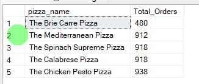

here's a look on the final Dashbord:

PIZZA SALES SQL QUERIES

# **A. KPI’s**

**1. Total Revenue:**

SELECT SUM(total\_price) AS Total\_Revenue FROM pizza\_sales;

**2. Average Order Value**

SELECT (SUM(total\_price) / COUNT(DISTINCT order\_id)) AS Avg\_order\_Value FROM pizza\_sales

**3. Total Pizzas Sold**

SELECT SUM(quantity) AS Total\_pizza\_sold FROM pizza\_sales

**4. Total Orders**

SELECT COUNT(DISTINCT order\_id) AS Total\_Orders FROM pizza\_sales

**5. Average Pizzas Per Order**

SELECT CAST(CAST(SUM(quantity) AS DECIMAL(10,2)) / COUNT(DISTINCT order\_id)) AS DECIMAL(10,2))

AS Avg\_Pizzas\_per\_order

FROM pizza\_sales

**B. Daily Trend for Total Orders**
===============================================================================================
SELECT DATENAME(DW, order\_date) AS order\_day, COUNT(DISTINCT order\_id) AS total\_orders

FROM pizza\_sales

GROUP BY DATENAME(DW, order\_date)

***Output:***

# **C. Monthly Trend for Orders**

select DATENAME(MONTH, order\_date) as Month\_Name, COUNT(DISTINCT order\_id) as Total\_Orders

from pizza\_sales

GROUP BY DATENAME(MONTH, order\_date)***Output***

# **D. % of Sales by Pizza Category**

SELECT pizza\_category, CAST(SUM(total\_price) AS DECIMAL(10,2)) as total\_revenue,

CAST(SUM(total\_price) \* 100 / (SELECT SUM(total\_price) from pizza\_sales) AS DECIMAL(10,2)) AS PCT

FROM pizza\_sales

GROUP BY pizza\_category

***Output***

# **E. % of Sales by Pizza Size**

SELECT pizza\_size, CAST(SUM(total\_price) AS DECIMAL(10,2)) as total\_revenue,

CAST(SUM(total\_price) \* 100 / (SELECT SUM(total\_price) from pizza\_sales) AS DECIMAL(10,2)) AS PCT

FROM pizza\_sales

GROUP BY pizza\_size

ORDER BY pizza\_size

***Output***

# **F. Total Pizzas Sold by Pizza Category**

SELECT pizza\_category, SUM(quantity) as Total\_Quantity\_Sold

FROM pizza\_sales

WHERE MONTH(order\_date) = 2

GROUP BY pizza\_category

ORDER BY Total\_Quantity\_Sold DESC

***Output***

# **G. Top 5 Pizzas by Revenue**

SELECT Top 5 pizza\_name, SUM(total\_price) AS Total\_Revenue

FROM pizza\_sales

GROUP BY pizza\_name

ORDER BY Total\_Revenue DESC

# **H. Bottom 5 Pizzas by Revenue**

SELECT Top 5 pizza\_name, SUM(total\_price) AS Total\_Revenue

FROM pizza\_sales

GROUP BY pizza\_name

ORDER BY Total\_Revenue ASC

# **I. Top 5 Pizzas by Quantity**

SELECT Top 5 pizza\_name, SUM(quantity) AS Total\_Pizza\_Sold

FROM pizza\_sales

GROUP BY pizza\_name

ORDER BY Total\_Pizza\_Sold DESC

***Output***

# **J. Bottom 5 Pizzas by Quantity**

SELECT TOP 5 pizza\_name, SUM(quantity) AS Total\_Pizza\_Sold

FROM pizza\_sales

GROUP BY pizza\_name

ORDER BY Total\_Pizza\_Sold ASC

***Output***

# **K. Top 5 Pizzas by Total Orders**

SELECT Top 5 pizza\_name, COUNT(DISTINCT order\_id) AS Total\_Orders

FROM pizza\_sales

GROUP BY pizza\_name

ORDER BY Total\_Orders DESC

# **L. Borrom 5 Pizzas by Total Orders**

SELECT Top 5 pizza\_name, COUNT(DISTINCT order\_id) AS Total\_Orders

FROM pizza\_sales

GROUP BY pizza\_name

ORDER BY Total\_Orders ASC

***NOTE***

If you want to apply the pizza\_category or pizza\_size filters to the above queries you can use WHERE clause. Follow some of below examples

SELECT Top 5 pizza\_name, COUNT(DISTINCT order\_id) AS Total\_Orders

FROM pizza\_sales

WHERE pizza\_category = 'Classic'

GROUP BY pizza\_name

ORDER BY Total\_Orders ASC
